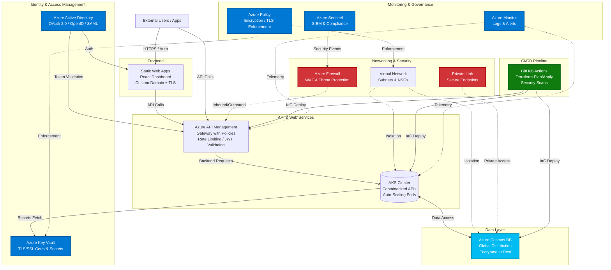
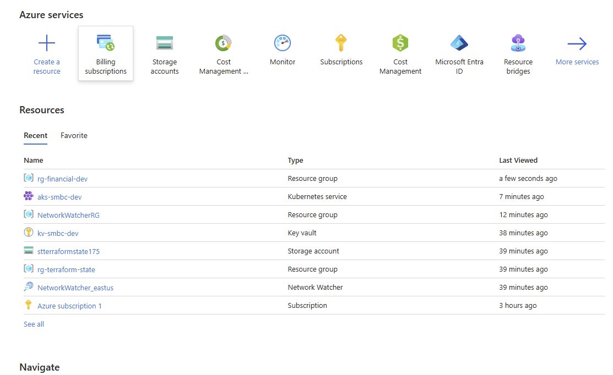

# Secure Financial Services Platform on Azure

[](https://azure.microsoft.com/) [](https://www.terraform.io/) [](https://github.com/features/actions)

This repository demonstrates a secure, scalable Azure cloud solution for financial services, tailored for institutions like Sumitomo Mitsui Banking Corporation (SMBC). It implements a mission-critical platform for risk-mitigated API/web services using Azure best practices, Terraform as Infrastructure as Code (IaC), and a CI/CD pipeline with GitHub Actions. The design emphasizes zero-trust security, regulatory compliance (e.g., PCI DSS, SOC 2), and cross-functional governance.

## Project Overview

The platform supports financial applications such as treasury management APIs and global markets dashboards. Key features:

- **Scalable Architecture**: Azure Kubernetes Service (AKS) for containerized apps, Azure API Management (APIM) for API gateway, and Cosmos DB for global data distribution.
- **Security Standards**: TLS 1.3, OAuth 2.0/OpenID Connect, SAML federation via Azure AD; Azure Defender for threat protection.
- **Governance**: Azure Policy for compliance enforcement, RBAC for access control, and Blueprints for repeatable environments.
- **CI/CD**: Automated provisioning and testing via GitHub Actions, with IaC security scans (e.g., Checkov).
- **Cross-Functional Integration**: Aligns with Security (Key Vault), DevOps (Azure Monitor), and Application teams.
- **Sample Apps**: Node.js API for treasury endpoints; static HTML/JS dashboard.

This setup ensures consistency, auditability, and risk mitigation in a highly regulated environment.

## High-Level Architecture

Below is a Mermaid diagram illustrating the architecture.



## Prerequisites

* Azure Subscription: With Contributor role; enable necessary services (e.g., AKS, APIM, Container Registry).

* GitHub Repository: Fork/clone this repo and enable GitHub Actions.

* Tools:

  * Terraform v1.5+ (or use Azure Cloud Shell).

  * Azure CLI: Authenticate with `az login`.

  * Docker: For building sample app images.

  * kubectl: For AKS interactions (optional, post-deployment). Install with `az aks install-cli`.

* Azure AD App Registration: For OAuth/OpenID. Register an app in Azure AD, note Client ID/Tenant ID. Expose API scope e.g., `api://treasury-api/.default`.

* GitHub Secrets: In repo Settings > Secrets and variables > Actions, add:

  * `AZURE_SUBSCRIPTION_ID`: Your Azure sub ID.

  * `AZURE_CLIENT_ID`: From OIDC federation (create Service Principal with `az ad sp create-for-rbac --sdk-auth`).

  * `AZURE_TENANT_ID`: Your Azure AD tenant ID.

  * `AZURE_AKS_KUBECONFIG`: (Post-deploy) Output from Terraform.

  * `AZURE_STATIC_WEB_APPS_API_TOKEN`: (Optional) For web deploy; generate from Static Web App resource.

## Project Structure

```
financial-services-azure-platform/
├── .github/workflows/
│ ├── ci-cd.yml # Main CI/CD pipeline
│ └── terraform-plan.yml # PR validation workflow
├── terraform/
│ ├── main.tf # Root module entrypoint
│ ├── variables.tf # Input variables
│ ├── outputs.tf # Outputs (e.g., kubeconfig)
│ ├── modules/ # Reusable Terraform modules
│ │ ├── acr/ # Azure Container Registry
│ │ ├── aks-cluster/ # AKS with auto-scaling
│ │ ├── apim-gateway/ # APIM with auth policies
│ │ ├── cosmos-db/ # Secure Cosmos DB
│ │ ├── key-vault/ # Key Vault for secrets
│ │ └── policies/ # Azure Policy assignments
│ └── environments/
│ ├── dev.tfvars # Dev environment vars
│ └── prod.tfvars # Prod environment vars
├── sample-app/
│ ├── api/ # Node.js sample API (OAuth-integrated)
│ │ └── k8s/ # Kubernetes manifests
│ └── web/ # Static HTML/JS sample web app (MSAL auth)
├── docs/
│ └── governance.md # Compliance and governance notes
└── README.md # This file
```

## Deployment Instructions

### Step 1: Prepare Azure Resources

1. Login to Azure CLI: `az login`.

2. Create a Service Principal for GitHub OIDC (secure auth, no secrets):

   ```bash:disable-run
   az ad sp create-for-rbac --name "github-oidc" --role contributor --scopes /subscriptions/<sub-id>/resourceGroups/rg-financial-dev --sdk-auth
   ```

   Copy the output JSON; extract clientId, clientSecret, tenantId. Add to GitHub Secrets as `AZURE_CLIENT_ID`, etc. (Use OIDC for prod).

3. Update `environments/dev.tfvars` with your `tenant_id`.

### Step 2: Local/ Manual Deployment

1. Clone and Initialize

   ```bash
   git clone https://github.com/kdahal/financial-services-azure-platform.git
   cd financial-services-azure-platform
   ```

2. Init Terraform

   ```bash
   cd terraform
   terraform init
   ```

3. Plan (use dev for testing)

   ```bash
   terraform plan -var-file="../environments/dev.tfvars"
   ```

4. Apply

   ```bash
   terraform apply -var-file="../environments/dev.tfvars"
   ```

   * This deploys RG, ACR, Key Vault, Cosmos DB, AKS, APIM, Policies.

   * Note outputs: `apim_endpoint`, `aks_kubeconfig`, `acr_login_server`. Export kubeconfig: `az aks get-credentials --resource-group rg-financial-dev --name aks-smbc-dev`.

5. Build & Deploy API

   ```bash
   cd ../sample-app/api
   docker build -t acrsmbcdev.azurecr.io/sample-api:latest .
   az acr login --name acrsmbcdev
   docker push acrsmbcdev.azurecr.io/sample-api:latest
   cd ../..
   kubectl apply -f sample-app/api/k8s/deployment.yaml
   # Get LoadBalancer IP: kubectl get svc treasury-api-service -o jsonpath='{.status.loadBalancer.ingress[0].ip}'
   # Update backend_url in dev.tfvars with https://<IP>, then re-apply if needed
   ```

6. Deploy Web App

   * In Azure Portal: Create Static Web App > Link to GitHub repo > Set app location `/sample-app/web`.

   * Or trigger the optional workflow by pushing to main.

7. Test

   * API Health: `curl https://<apim-endpoint>/health` (via APIM proxy).

   * Auth Test: Get token from Azure AD (use Postman with OAuth), then `curl -H "Authorization: Bearer <token>" https://<apim-endpoint>/treasury/transactions`.

   * Web: Visit Static Web App URL, login, see transactions.

### Step 3: CI/CD Deployment (Automated)

* Push to main: Triggers `ci-cd.yml` → Terraform apply (prod) → Docker build/push → K8s deploy.

* PR to main: Triggers `terraform-plan.yml` → Plan output in comments.

* Monitor: GitHub > Actions.

* Deployment time: ~10-15 mins for infra; ~5 mins for apps.

* Costs: Minimal for dev (~$0.50/hr for AKS; monitor in Portal).

## Cleanup: Delete All Resources (Avoid Costs)

To tear down everything and stop billing:

1. Destroy Terraform resources:

   ```bash
   terraform destroy -var-file="environments/dev.tfvars" # Confirm 'yes'
   ```

   * This removes RG, AKS, APIM, Cosmos, etc. (Idempotent; safe).

2. Delete ACR images (if manual pushes):

   ```bash
   az acr repository delete --name acrsmbcdev --image sample-api:latest --yes
   ```

3. Delete Static Web App (Portal > Resource > Delete).

4. Revoke Service Principal (if created):

   ```bash
   az ad sp delete --id <client-id>
   ```

5. Check Azure Portal > Cost Management for any lingering resources; set budgets/alerts for future. Run destroy immediately after testing. Total cost for 1-hour test: <$1.

## Security and Compliance

* Encryption: TLS 1.3 enforced; data at rest via Azure-managed keys.

* Authentication: OAuth/OpenID via Azure AD; SAML for federation. APIM policies validate JWTs.

* Risk Controls: Rate limiting, IP filters, WAF in APIM; Azure Sentinel for alerts.

* Governance:

  * Azure Policies: Enforce encryption, TLS minimums.

  * RBAC: Least-privilege (e.g., Security team owns Key Vault).

  * Logging: 365-day retention in Azure Monitor.

* Standards Alignment: PCI DSS (encryption), SOC 2 (auditing). See `docs/governance.md` for mappings.

## Monitoring and Maintenance

* Azure Monitor: Dashboards for AKS metrics, APIM logs.

* Terraform Drift Detection: Run `terraform plan` periodically.

* Updates: Version modules; use terraform providers lock for consistency.

* Cost Optimization: Tag resources; use reserved instances for prod.

## Contributing and Mentoring

* Code Reviews: PRs require approvals; focus on security/IaC best practices.

* Mentoring: Document changes in PRs; pair on complex modules.

* Issues: Report bugs or enhancements via GitHub Issues.

## Next Steps

* Customize for SMBC: Add Japan East region, integrate with enterprise AD.

* Scale: Implement Horizontal Pod Autoscaler in AKS.

* Test: Run load tests with Azure Load Testing.

* Expand: Add Azure Front Door for global routing. For questions, contact the DevOps team or open an issue. This project aligns with Azure DevOps Architect responsibilities—deploy, govern, and innovate securely!

**Last Updated:** October 05, 2025

**License:** MIT (see LICENSE file)
```


