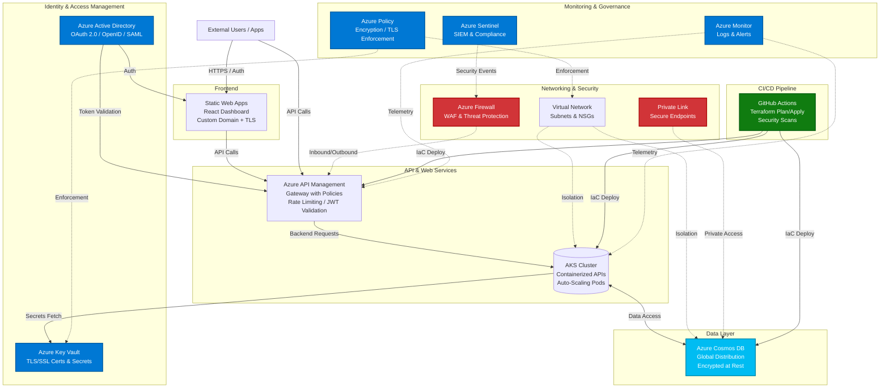

# Secure Financial Services Platform on Azure

[](https://azure.microsoft.com/) [](https://www.terraform.io/) [](https://github.com/features/actions)

This repository demonstrates a secure, scalable Azure cloud solution for financial services, tailored for institutions like Sumitomo Mitsui Banking Corporation (SMBC). It implements a mission-critical platform for risk-mitigated API/web services using Azure best practices, Terraform as Infrastructure as Code (IaC), and a CI/CD pipeline with GitHub Actions. The design emphasizes zero-trust security, regulatory compliance (e.g., PCI DSS, SOC 2), and cross-functional governance.

## Project Overview

The platform supports financial applications such as treasury management APIs and global markets dashboards. Key features:
- **Scalable Architecture**: Azure Kubernetes Service (AKS) for containerized apps, Azure API Management (APIM) for API gateway, and Cosmos DB for global data distribution.
- **Security Standards**: TLS 1.3, OAuth 2.0/OpenID Connect, SAML federation via Azure AD; Azure Defender for threat protection.
- **Governance**: Azure Policy for compliance enforcement, RBAC for access control, and Blueprints for repeatable environments.
- **CI/CD**: Automated provisioning and testing via GitHub Actions, with IaC security scans (e.g., Checkov).
- **Cross-Functional Integration**: Aligns with Security (Key Vault), DevOps (Azure Monitor), and Application teams.

This setup ensures consistency, auditability, and risk mitigation in a highly regulated environment.

## High-Level Architecture

Below is a Mermaid diagram illustrating the architecture. Copy-paste into [mermaid.live](https://mermaid.live) for interactivity.


```mermaid
graph TB
    subgraph "Identity & Access Management"
        AAD[Azure Active Directory<br/>OAuth 2.0 / OpenID / SAML]
        KV[Azure Key Vault<br/>TLS/SSL Certs & Secrets]
    end

    subgraph "Networking & Security"
        VNet[Virtual Network<br/>Subnets & NSGs]
        AFW[Azure Firewall<br/>WAF & Threat Protection]
        PL[Private Link<br/>Secure Endpoints]
    end

    subgraph "API & Web Services"
        APIM[Azure API Management<br/>Gateway with Policies<br/>Rate Limiting / JWT Validation]
        AKS[(AKS Cluster<br/>Containerized APIs<br/>Auto-Scaling Pods)]
    end

    subgraph "Data Layer"
        Cosmos[Azure Cosmos DB<br/>Global Distribution<br/>Encrypted at Rest]
    end

    subgraph "Frontend"
        SWA[Static Web Apps<br/>React Dashboard<br/>Custom Domain + TLS]
    end

    subgraph "Monitoring & Governance"
        AM[Azure Monitor<br/>Logs & Alerts]
        Sentinel[Azure Sentinel<br/>SIEM & Compliance]
        Policy[Azure Policy<br/>Encryption / TLS Enforcement]
    end

    subgraph "CI/CD Pipeline"
        GHA[GitHub Actions<br/>Terraform Plan/Apply<br/>Security Scans]
    end

    %% Flows
    User[External Users / Apps] -->|HTTPS / Auth| SWA
    SWA -->|API Calls| APIM
    User -->|API Calls| APIM
    APIM -->|Backend Requests| AKS
    AKS <-->|Data Access| Cosmos
    AKS -->|Secrets Fetch| KV
    AAD -->|Token Validation| APIM
    AAD -->|Auth| SWA
    VNet -.->|Isolation| AKS
    VNet -.->|Isolation| Cosmos
    AFW -.->|Inbound/Outbound| APIM
    PL -.->|Private Access| Cosmos
    GHA -->|IaC Deploy| AKS
    GHA -->|IaC Deploy| APIM
    GHA -->|IaC Deploy| Cosmos
    AM -.->|Telemetry| AKS
    AM -.->|Telemetry| APIM
    Sentinel -.->|Security Events| AFW
    Policy -.->|Enforcement| VNet
    Policy -.->|Enforcement| KV

    classDef azureStyle fill:#0078D4,stroke:#005A9E,stroke-width:2px,color:#fff;
    classDef securityStyle fill:#D13438,stroke:#A80000,stroke-width:2px,color:#fff;
    classDef dataStyle fill:#00BCF2,stroke:#0088A8,stroke-width:2px,color:#fff;
    classDef pipelineStyle fill:#107C10,stroke:#005A0E,stroke-width:2px,color:#fff;

    class AAD,KV,AM,Sentinel,Policy azureStyle;
    class AFW,PL securityStyle;
    class Cosmos dataStyle;
    class GHA pipelineStyle;
```

## Prerequisites

- **Azure Subscription**: With Contributor role; enable necessary services (e.g., AKS, APIM).
- **GitHub Repository**: Fork/clone this repo and enable GitHub Actions.
- **Tools**:
  - Terraform v1.5+ (or use [Azure Cloud Shell](https://shell.azure.com/)).
  - Azure CLI: Authenticate with `az login`.
  - Docker: For building sample app images.
  - kubectl: For AKS interactions (optional, post-deployment).
- **Secrets**: Store in GitHub Secrets:
  - `AZURE_SUBSCRIPTION_ID`
  - `AZURE_CLIENT_ID` (from OIDC app registration)
  - `AZURE_TENANT_ID`
- **Certifications**: Assumes Azure Solutions Architect Expert or equivalent knowledge.

## Project Structure

```
financial-services-azure-platform/
├── .github/workflows/
│   ├── ci-cd.yml                  # Main CI/CD pipeline
│   └── terraform-plan.yml         # PR validation workflow
├── terraform/
│   ├── main.tf                    # Root module entrypoint
│   ├── variables.tf               # Input variables
│   ├── outputs.tf                 # Outputs (e.g., kubeconfig)
│   ├── modules/                   # Reusable Terraform modules
│   │   ├── aks-cluster/           # AKS with auto-scaling
│   │   ├── apim-gateway/          # APIM with auth policies
│   │   ├── cosmos-db/             # Secure Cosmos DB
│   │   ├── key-vault/             # Key Vault for secrets
│   │   └── policies/              # Azure Policy assignments
│   └── environments/
│       ├── dev.tfvars             # Dev environment vars
│       └── prod.tfvars            # Prod environment vars
├── sample-app/
│   ├── api/                       # .NET Core sample API (OAuth-integrated)
│   │   └── k8s/                   # Kubernetes manifests
│   └── web/                       # React sample web app (MSAL auth)
├── docs/
│   └── governance.md              # Compliance and governance notes
└── README.md                      # This file
```

## Setup and Deployment

### 1. Clone and Initialize
```bash
git clone <your-repo-url>
cd financial-services-azure-platform
terraform init  # Initializes providers and backend
```

### 2. Configure Environment
Copy and edit `.tfvars` files in `terraform/environments/`:
```hcl
# Example: terraform/environments/prod.tfvars
location            = "East US 2"
environment         = "prod"
resource_group_name = "rg-smbc-prod"
```

### 3. Local Deployment (Terraform)
```bash
# Plan changes
terraform plan -var-file=environments/prod.tfvars

# Apply (deploy resources)
terraform apply -var-file=environments/prod.tfvars

# Outputs (e.g., APIM URL)
terraform output apim_endpoint
```

### 4. CI/CD Pipeline
- **Trigger**: Push to `main` or PRs.
- **Steps**: Validates IaC, runs security scans, applies Terraform, builds/pushes Docker images, deploys to AKS.
- View runs: GitHub > Actions tab.
- For PRs: Use `terraform-plan.yml` for diff previews.

Example workflow excerpt (`.github/workflows/ci-cd.yml`):
```yaml
name: SMBC Azure DevOps Pipeline
on:
  push:
    branches: [ main ]
  pull_request:
    branches: [ main ]
# ... (full YAML in repo)
```

### 5. Deploy Sample Application
After Terraform apply:
```bash
# Build and push API image (or via CI/CD)
docker build -t <your-acr>.azurecr.io/sample-api:latest ./sample-app/api/
az acr login --name <your-acr>
docker push <your-acr>.azurecr.io/sample-api:latest

# Deploy to AKS
kubectl apply -f sample-app/api/k8s/deployment.yaml
```

- **Test API**: `curl -H "Authorization: Bearer <token>" https://<apim-gateway>/treasury/transactions`
- **Web App**: Deploy to Static Web Apps via Azure Portal or GitHub integration.

## Security and Compliance

- **Encryption**: TLS 1.3 enforced; data at rest via Azure-managed keys.
- **Authentication**: OAuth/OpenID via Azure AD; SAML for federation. APIM policies validate JWTs.
- **Risk Controls**: Rate limiting, IP filters, WAF in APIM; Azure Sentinel for alerts.
- **Governance**: 
  - Azure Policies: Enforce encryption, TLS minimums.
  - RBAC: Least-privilege (e.g., Security team owns Key Vault).
  - Logging: 365-day retention in Azure Monitor.
- **Standards Alignment**: PCI DSS (encryption), SOC 2 (auditing). See `docs/governance.md` for mappings.

## Monitoring and Maintenance

- **Azure Monitor**: Dashboards for AKS metrics, APIM logs.
- **Terraform Drift Detection**: Run `terraform plan` periodically.
- **Updates**: Version modules; use `terraform providers lock` for consistency.
- **Cost Optimization**: Tag resources; use reserved instances for prod.

## Contributing and Mentoring

- **Code Reviews**: PRs require approvals; focus on security/IaC best practices.
- **Mentoring**: Document changes in PRs; pair on complex modules.
- **Issues**: Report bugs or enhancements via GitHub Issues.

## Next Steps

- Customize for SMBC: Add Japan East region, integrate with enterprise AD.
- Scale: Implement Horizontal Pod Autoscaler in AKS.
- Test: Run load tests with Azure Load Testing.
- Expand: Add Azure Front Door for global routing.

For questions, contact the DevOps team or open an issue. This project aligns with Azure DevOps Architect responsibilities—deploy, govern, and innovate securely!

---

*Last Updated: October 01, 2025*  
*License: MIT (see LICENSE file)*